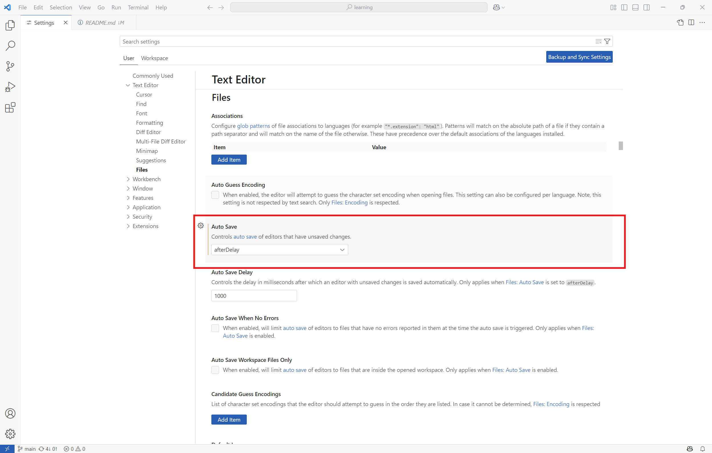
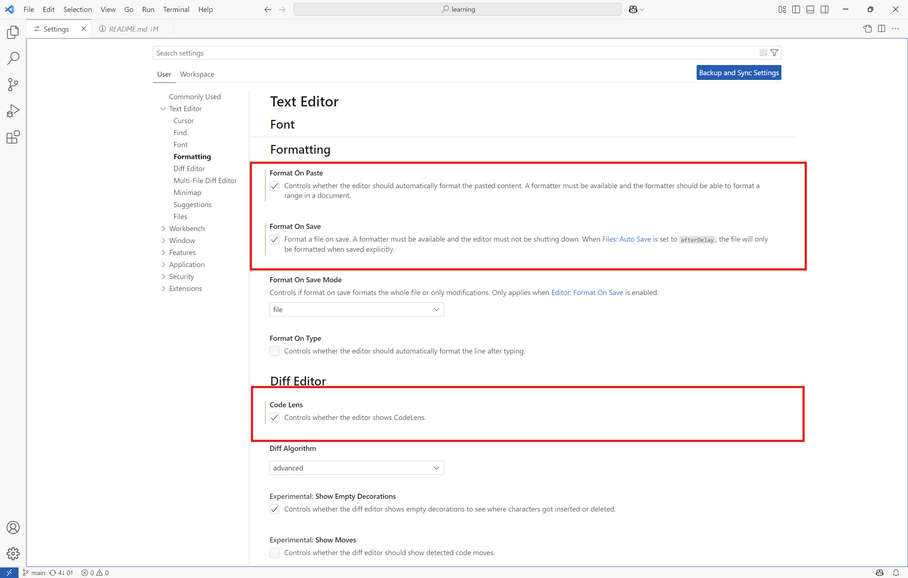
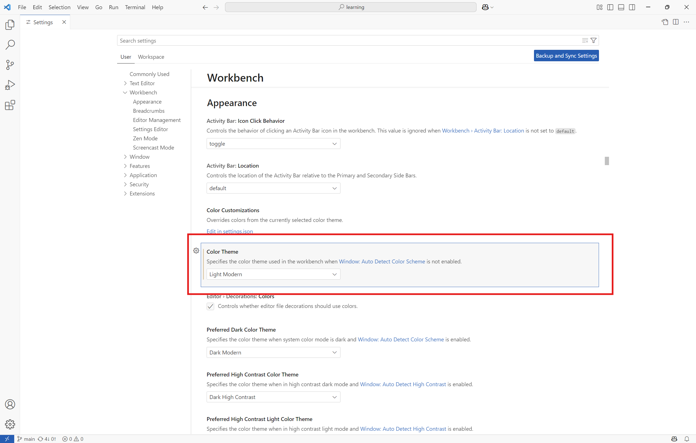
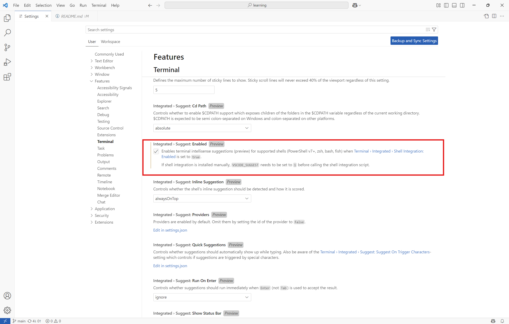

# Visual Studio Code

[Customizing VS Codes UI for Productivity](https://learn.microsoft.com/en-us/shows/visual-studio-code/customizing-vs-codes-ui-for-productivity)
[Multi Cursor](https://www.youtube.com/watch?v=1V4Lj8Eqdvc)
[5 serious time savers](https://www.youtube.com/watch?v=MLvLiWueESY)

### Text Editor

### Workbench

### Features > Terminal

