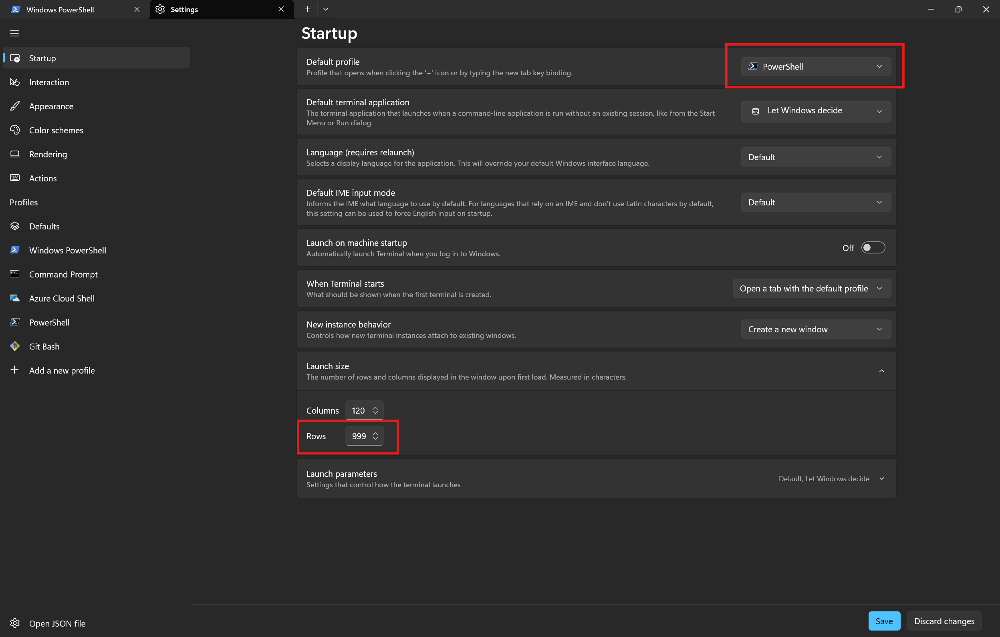
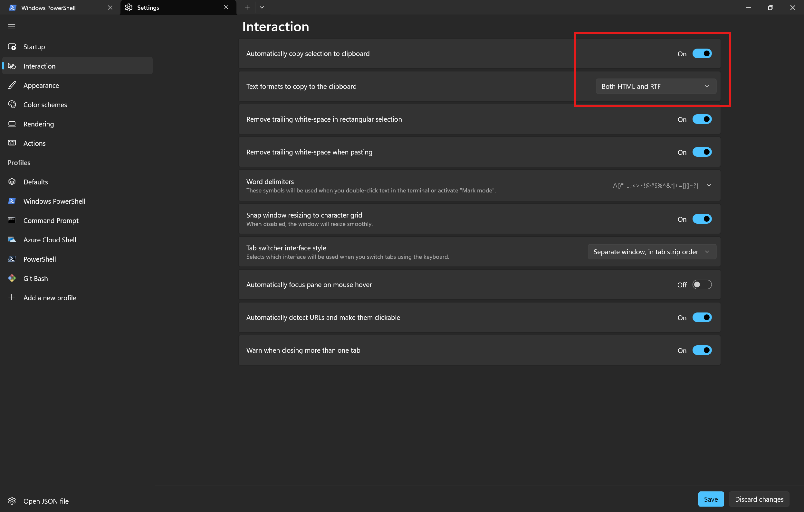
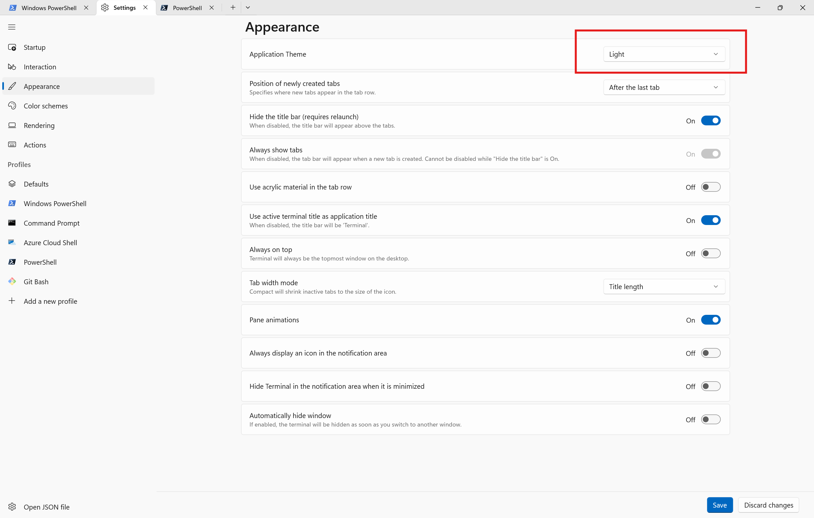
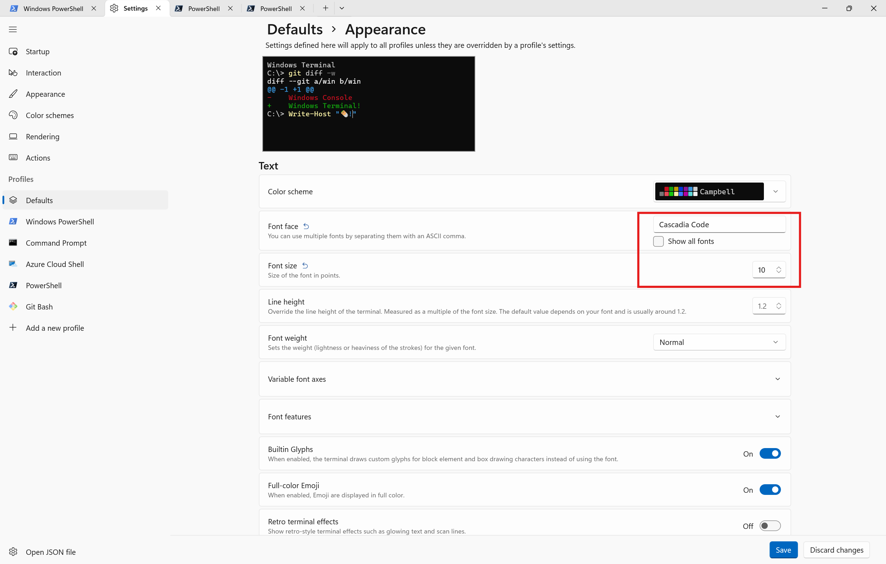

# Windows Machine Setup

1. Install Visual Studio Code from [code.visualstudio.com](https://code.visualstudio.com/)
2. Read about copilot instructions from
3. Install git `winget install --id Git.Git -e --source winget` and `git --version`
4. Install powershell `winget install --id Microsoft.Powershell --source winget` and `pwsh --version`
5. Install NodeJS `winget install --id OpenJS.NodeJS` and `node --version`
6. Install Python `winget install --id Python.Python.3.9` and `python --version`
7. Install ChatGpt from appstore
8. Navigate to claude.ai, login and pin to taskbar
9. Install Microsoft PowerToys `winget install --id Microsoft.PowerToys`
    1. Install Command Not Found from within powertoys
    2. Windows + Shift + V for advance paste
    3. Windows + Shift + C for color picker
    4. Ctrl + Space for really fast file preview
    5. Quick accent press char + Space. Long pause for picker
    6. Win + Ctrl + Shift + M Screen ruler
    7. Win + Shift + / Short cut menu
10. Install notepad++ `winget install --id Notepad++.Notepad++`
11. `winget install --id Microsoft.Sysinternals`

## Terminal Settings
The following changes were made to terminal settings

